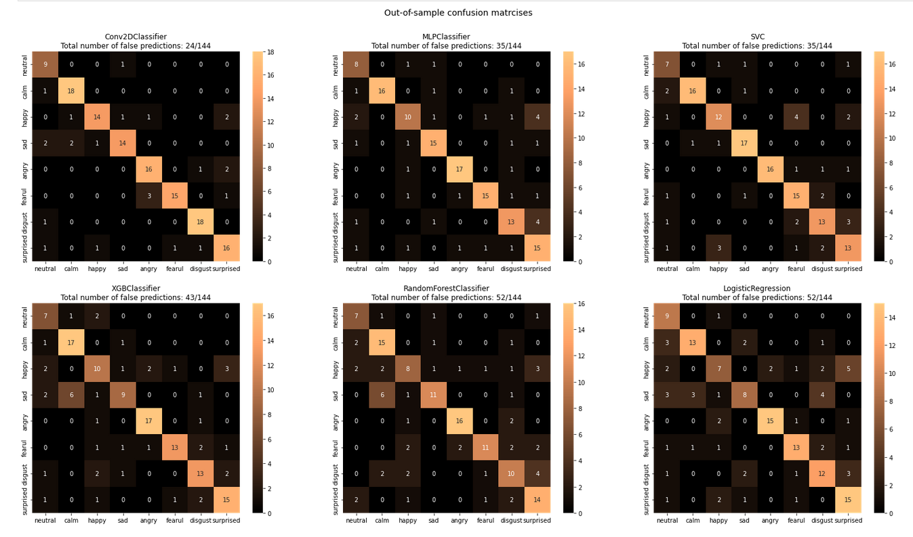

# Emotion classifier project

Purpose of this project is to create a machine learning model for emotion classification from audio data.
The dataset used is the The Ryerson audio-visual database of emotional speech and song (RAVDESS).

## About the dataset

The Ryerson audio-visual database of emotional speech and song (RAVDESS) is a database containing audio and audio-visual files of varying emotion
from total of 24 different professional actors. The full dataset contains 7356 files.
This project will be using only the speech portion of audio-only files reducing the number of files to 1440 = 24 actors * 60 trials.
This reduced dataset consists of two lexically-matched statements in a neutral North American accent having in total of 8 different emotional expressions of neutral, calm, happy, sad, angry, surprise and disgust. Each emotion has two intesity variants i.e. normal and strong. More info can be found at [RAVDESS](https://zenodo.org/record/1188976).

## Used models and precap of results

Out-of-sample F1-scores:
* Keras:
  * Multi-input Conv2D:   __0.829__
* Scikit-learn:
  * MLPClassifier:        0.755
  * SVC:                  0.752
  * XGBClassifier:        0.691
  * Random Forest:        0.636
  * LogisticRegression:   0.634
  

